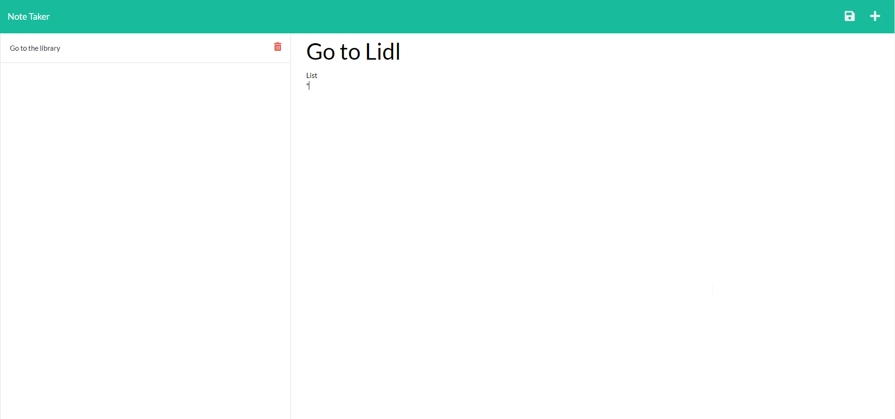

# note-taker

## Description 
Sample
 
## Table of Contents
* [Installation](#installation)
* [Preview](#preview)
* [License](#license)
* [Questions](#questions)

## Installation 
Clone the repository to your local development environment.

Run npm install to install all dependencies. To use the application locally, run node server.js in your CLI, and then open http://localhost:3000 in your preferred browswer.

## Preview
Sample 

## License 
This project is license under MIT

## Questions
If you have any questions about this projects, feel free to contact me at <a href='mailto:andrew@creativeaero.space'>andrew@creativeaero.space</a>. You can view more of my projects at <a href='https://github.com/andrew-byrd49'>Andrew-Byrd49</a>